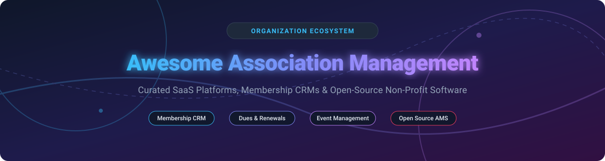

  

# 🏢 Awesome Association Management Software & Tools 🚀

  
  
  
  
  

## 📌 Top Association Management Systems (AMS), Membership CRMs & Nonprofit Tech Ecosystem

> **Discover the ultimate curated list of top SaaS products, cloud platforms, and open-source GitHub repositories for Association Management Systems (AMS), Membership CRMs, automated dues & renewal billing, event ticketing, member portals, and community engagement platforms.** 💡

🗓️ **Last updated:** September 2026

This repository tracks notable **SaaS platforms** and **open-source projects** for **Association Management**. These systems enable professional trade associations, non-governmental organizations (NGOs), chambers of commerce, clubs, and non-profits to manage member lifecycles, automated subscription renewals, event calendars, member directories, and community networking from a single unified hub.

---

## 📑 Table of Contents

- [☁️ SaaS / Hosted Platforms](#%EF%B8%8F-saas--hosted-platforms)
- [💻 Open-Source GitHub Projects](#-open-source-github-projects)
- [🤝 How to Contribute](#-how-to-contribute)
- [💖 Support & Sponsorship](#-support--sponsorship)
- [⚠️ Disclaimer](#%EF%B8%8F-disclaimer)
- [📈 Star History](#-star-history)

---

## ☁️ SaaS / Hosted Platforms

> 📊 **Market Insights:** The global Association Management Software (AMS) market is currently estimated at **$2.4B – $2.6B** and is **moderately fragmented**, consisting of established legacy providers, venture-backed modern SaaS suites, and specialized community engines.

| Product | Size / Financials (ARR / Valuation / Funding) 📈 | Starting Tier Price 💵 | Free Tier / Trial Limit ⏳ | Description 📝 |
| :--- | :--- | :--- | :--- | :--- |
| **[Higher Logic](https://www.higherlogic.com/)** | ~$68.3M ARR | $9,000 / year ($750/mo) | No free trial; live demo upon request | Community & member engagement platform for associations. |
| **[Glue Up](https://www.glueup.com/)** | ~$14.1M ARR ($10M+ raised) | $3,000 / year ($250/mo) | Free trial membership for prospect testing; demo for full app | All-in-one CRM, event & member management suite. |
| **[WildApricot](https://www.wildapricot.com/)** | ~$12.0M ARR (Acquired by Personify) | $60 / month (up to 100 contacts) | 60-day free trial (up to 50 contacts, restricted payments/custom domains) | Leading cloud membership software for small associations. |
| **[Mighty Networks](https://www.mighty.com/)** | ~$8.6M ARR ($67M valuation / $50M raised) | $119 / month (Courses Plan) | 14-day free trial (full platform access) | Cultural & community software for member networks and courses. |
| **[GrowthZone](https://www.growthzone.com/)** | ~$4.6M ARR | $4,000 / year ($333/mo) | No free trial; demo request required | AMS for chambers of commerce and trade associations. |
| **[YourMembership](https://www.yourmembership.com/)** | ~$4.0M ARR (Part of Community Brands) | $3,990 / year ($332.50/mo) | No free trial; demo request required | Established AMS for small-to-midsize membership orgs. |
| **[MemberClicks](https://www.memberclicks.com/)** | ~$3.5M ARR (Part of Personify) | $3,500 / year ($291.66/mo) | No free trial; demo request required | Software tailored for small-staff associations and chambers. |
| **[MemberNova](https://www.membernova.com/)** | ~$880K ARR | $250 / month | No free trial; custom demo required | Enterprise-grade member management & portal platform. |
| **[Neon CRM](https://www.neoncrm.com/)** | Private (Neon One Ecosystem) | $99 / month | 14-day free trial (guided trial account) | Nonprofit CRM & membership management system. |
| **[ClubExpress](https://www.clubexpress.com/)** | Private (Acquired by Lumaverse) | $24 / month minimum (42¢/member/month for up to 200 members) | 30-day free trial / interactive sandbox site | Turnkey association & club management platform. |

---

## 💻 Open-Source GitHub Projects

| Project 🚀 | GitHub_Stars ⭐ | Description 📝 |
| :--- | :--- | :--- |
| **[Odoo](https://github.com/odoo/odoo)** |  | Open ERP suite with modular membership, event, and dues apps. |
| **[Nextcloud Server](https://github.com/nextcloud/server)** |  | Open-source collaboration platform used by associations for member file sharing and groupware. |
| **[ChurchCRM](https://github.com/ChurchCRM/CRM)** |  | Open-source CRM for managing member registries, groups, events, and trackable donations. |
| **[CiviCRM](https://github.com/civicrm/civicrm-core)** |  | Leading open constituent & membership CRM for nonprofits and associations. |
| **[Tendenci](https://github.com/tendenci/tendenci)** |  | Open-source Management System (AMS) built specifically for associations and nonprofits. |
| **[Admidio](https://github.com/Admidio/admidio)** |  | Free open-source user management system for clubs and organizations with role permissions. |
| **[MemberMatters](https://github.com/membermatters/MemberMatters)** |  | Open-source membership and access control portal designed for makerspaces and community orgs. |
| **[Uni-verein](https://github.com/uni-verein/uni-verein)** |  | Web app for university associations to manage members, dues, documents, and events. |
| **[Project60 Membership](https://github.com/Project60/org.project60.membership)** |  | CiviCRM extension enhancing membership fee tracking and auto-renewal logic. |
| **[Socius](https://github.com/rufusinfabula/socius)** |  | Open-source NGO/association management software for member registry, payments, and assembly minutes. |

---

## 🤝 How to Contribute

We welcome community contributions! Follow these steps to submit a new entry:

1. 🍴 **Fork** the repository.
2. ✏️ Add or update entries in `README.md` following the table format.
3. 📋 Include exact product name, official website/repo link, detailed description, and verifiable pricing/financial data.
4. 🔀 Submit a **Pull Request (PR)** with a summary of changes.

🌟 *Don't forget to star this repository if you find it helpful!*

---

## 💖 Support & Sponsorship

Thank you for exploring and supporting the **Awesome Association Management** collection! 

If you find this resource valuable for your association, non-profit, or development project, please consider showing your support:

- ⭐ **Star** this repository to help others discover it.
- 🔀 **Fork** and share it with fellow community leaders, CTOs, and association executives.
- ☕ **Buy me a coffee / Sponsor**: If you'd like to support open-source maintenance and ongoing curation, consider sponsoring via the [GitHub Sponsor Dashboard](https://github.com/sponsors/ishandutta2007). Your support is greatly appreciated!

---

## ⚠️ Disclaimer

- This list is **community-curated** for informational purposes and does not constitute an endorsement.
- Association software processes confidential member, financial, and payment data. Ensure GDPR/CCPA compliance and PCI-DSS certified payment integrations.
- Self-hosted open-source software requires dedicated server maintenance, security patches, and backups.

---

## 📈 Star History

---

  <b>Made with ❤️ for association executives, non-profit technologists, and community managers worldwide.</b>

